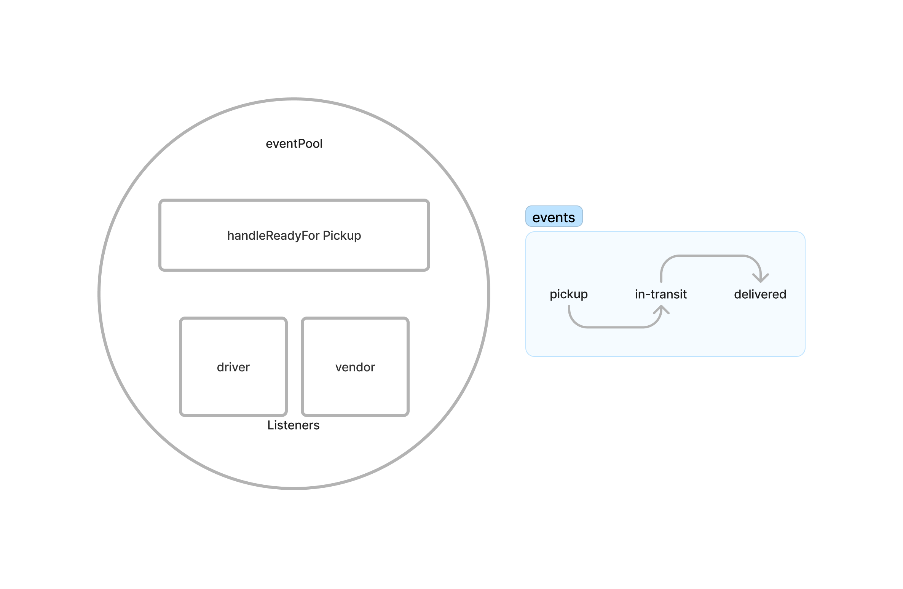

# LAB - Class 11 & 12

## Project: CAPS - The Code Academy Parcel Service

### Author: Donna Ada

### Problem Domain

Begin the build of an application for a product called CAPS - The Code Academy Parcel Service. In this sprint, we’ll build out a system that emulates a real world supply chain. CAPS will simulate a delivery service where vendors (such a flower shops) will ship products using our delivery service and when our drivers deliver them, each vendor will be notified that their customers received what they purchased.

This will be an event driven application that “distributes” the responsibility for logging to separate modules, using only events to trigger logging based on activity.

Lab 12: Incoporate the use of Socket.IO
Lab 13: Adding a new module to the CAPS Application Server to guarantee that payloads from events are delivered to any Client Module that is listening for specific events. This lab will refactor the Server and Client Modules to persist payloads on the Server side and remove them once received by clients.

### Links and Resources

- [GitHub Actions ci/cd](https://github.com/donnaada/caps/actions)

### Collaborators & Contributors

Ryan Gallaway
Reece Renninger
Kaeden O'Meara

### Setup

#### How to run your application

  - Clone repo
  - Run `npm i`
  - Run `node hub.js`

#### UML

